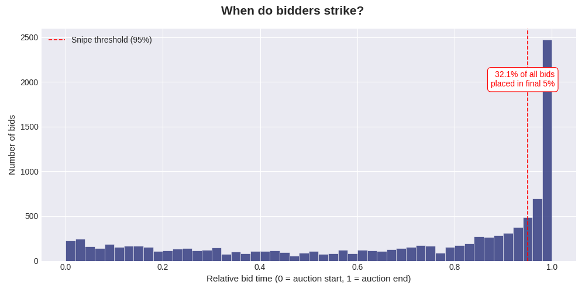
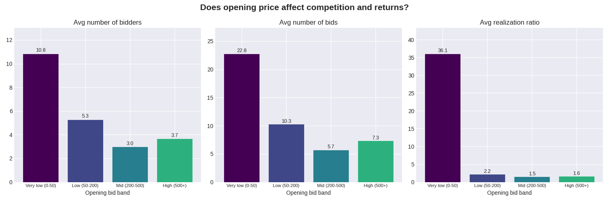
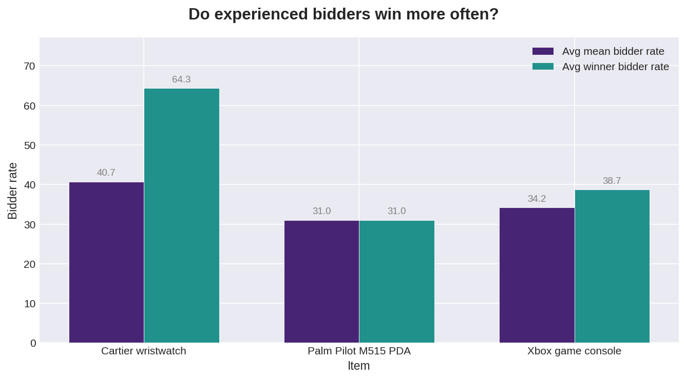

# Exploratory analysis of bidding patterns in online auctions

## Project overview
This project is a preliminary exploration of how data from digital auction platforms can be used to understand bidder behavior. As traditional auction houses increasingly move toward hybrid and digital models, there is an opportunity to use granular transaction data to support specialists in their valuation and cataloging processes. 

The goal is not to replace the expert’s "eye," but to see if we can identify recurring patterns in the "bid-stream" that might help predict interest levels or optimal starting prices.

## The data
The analysis uses a historical dataset of bidding activity from eBay, specifically focused on items that sit between the luxury and collectible markets. 

The dataset is from a companion website for the book *Modeling Online Auctions*, by Wolfgang Jank and Galit Shmueli (Wiley and Sons, ISBN: 978-0-470-47565-2, July 2010).  

* **Context:** While eBay is a high-volume platform, it provides a high-resolution look at how bidders react to price and time-principles that are often universal across different auction formats.  
* **Scope:** The dataset includes opening bids, individual bid increments, bidder reputation scores and the final hammer price.

## Areas of exploration
My focus during this project is to look at three specific possibilities for data-driven insights:

1. **Temporal behavior (Sniping):** Identifying what percentage of activity happens in the final minutes of a sale.  Understanding this "climax" can help an auction house decide if they should implement features like "soft-closes" or "dynamic endings."

2.  **Price discovery and estimates:** Examining the relationship between the starting bid and the final result. I wanted to see if lower opening prices consistently lead to more "bidding wars" compared to starting closer to a fair market  

3.  **Bidder engagement:** Using bidder reputation scores as a proxy for experience. This helps in understanding if a specific category is attracting seasoned collectors or new, casual buyers.

## Reflection

Overall, the analysis delivered clear and actionable findings across all three areas of exploration, though not every hypothesis was confirmed.

**Temporal behaviour** produced the most visually compelling result. Nearly one in three bids (32.1%) is placed in the final 5% of auction time, a structural pattern consistent across all item categories. Contrary to expectations however, auctions won by a snipe bid do not produce higher hammer prices, suggesting that sniping is a defensive strategy used to avoid counter-bids, rather than an aggressive tactic that drives prices up. The concentration of last-minute activity nonetheless makes a strong practical case for implementing a soft-close mechanism.  

  

**Price discovery** yielded the strongest quantitative evidence. Lower opening prices consistently attract more bidders, generate more bids and produce higher realization ratios: auctions opening below $50 attracted nearly three times more bidders than any other price band. The key nuance is that setting opening prices too close to zero inflates performance metrics mathematically without necessarily reflecting genuine demand. The practical recommendation is to set a starting price that reflects a credible reserve value for the item, low enough to invite broad participation without distorting the outcome.  
  
    

**Bidder engagement** revealed that experience, measured by platform feedback score, is not a universal predictor of winning. Its relevance is category-dependent: in Cartier auctions, winners are meaningfully more experienced than the average participant, while in Palm Pilot and Xbox auctions experience plays almost no role. This suggests that high-value categories attract a more strategically sophisticated buyer pool, while lower-value categories are driven primarily by willingness to pay.  

  

## Installation

Clone the repo and install dependencies:  
`git clone https://github.com/IreneGrisenti/Online_Auction_Analysis.git`

Create and activate virtual environment:  
`python -m venv .venv`

Windows PowerShell:  
`.venv\Scripts\Activate`

macOS/Linux:  
`source .venv/bin/activate`

Install dependencies:  
`cd Online_Auction_Analysis python -m pip install -r requirements.txt`

## Environment

Python: 3.12.3  
Packages: Numpy, Pandas, Matplotlib, Jupyter (see requirements.txt)